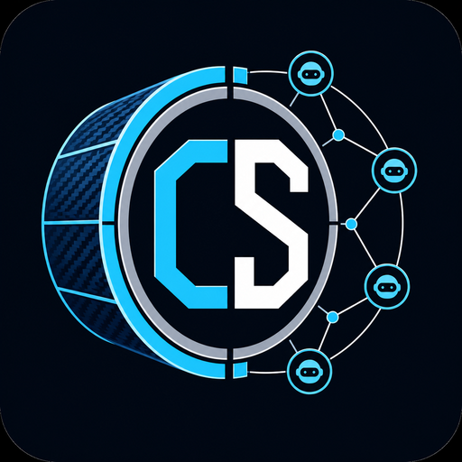
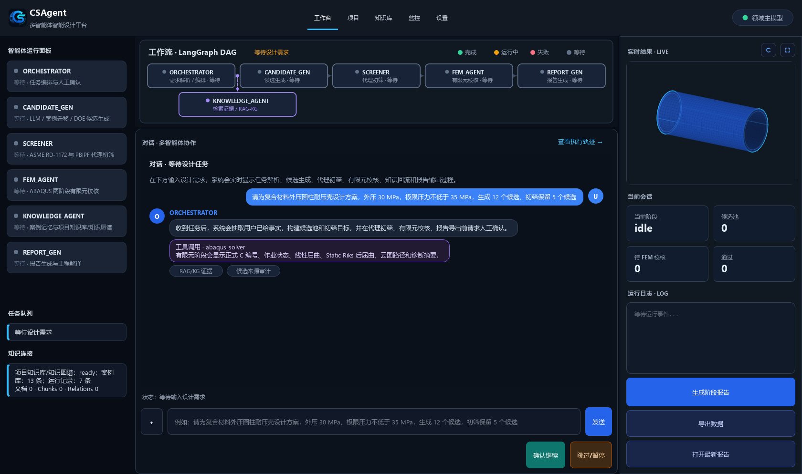

# CSAgent 多智能体智能设计平台

<p align="center">
  
</p>

CSAgent 多智能体智能设计平台面向复合材料外压圆柱耐压壳智能设计。主流程为：

自然语言需求 -> 用户事实抽取 -> LLM 候选提案 -> 案例迁移 -> DOE 采样 -> PBIPF 公式初筛 -> ABAQUS 校核 -> 案例回流 -> 设计报告输出。

`config/app_config.yaml` 中的产品显示名为 `CSAgent 多智能体智能设计平台`，`CSDM_cph` 仅作为本地目录、包名和环境变量前缀使用，不作为界面、报告或运行记录中的用户可见产品名。

主对话流程接入 `workflow/` 多智能体运行时。该运行时使用 LangGraph 状态图组织任务解析、候选生成、代理初筛、有限元校核、知识回流和报告导出，并通过 SQLite 记录运行事件、工具调用和状态快照。PyQt6 工作台支持流程恢复、智能体运行追踪和可视化状态展示。

## 设计对象

- 壳体类型：外压圆柱耐压壳 `CYLINDRICAL`
- 几何变量：`length_mm`、`radius_mm`、`thickness_mm`
- 铺层变量：`alpha_deg`、`beta_deg`、`imperfection_ratio`
- 材料体系：`T700/Epoxy`、`T800G/5228`、`M40J/TDE-85`
- 工况：外部静水压力 `external_pressure_MPa`
- 目标：极限压力不低于 `ultimate_pressure_min_MPa`，并按面密度或质量目标排序
- 流程参数：候选池总数和初筛保留数由自然语言明确指定
- 候选来源初始比例：`LLM:案例迁移:DOE = 2:1:1`，实际来源统计以有效候选为准

普通长度、半径、厚度、铺层角或缺陷比写入 `geometry_reference`，用于设计中心和几何包络；明确固定的几何条件写入 `fixed_geometry`。普通几何参考值不会强制所有候选等于该数值。

## GUI 工作台

PyQt6 桌面端默认为简体中文界面，顶部语言选择器支持切换为 English，主题选择器支持跟随系统、深色工程和亮色工程。界面语言和主题写入 `data/runtime/ui_settings.json`，属于本地运行偏好，不进入 Git。桌面端启动时优先加载 `HarmonyOS Sans SC`、`Noto Sans SC` 和 Windows 中文字体，避免中文标签、状态栏和可视化图注显示为方块。

主界面采用 `QMainWindow + QSplitter + QStackedWidget` 工程工作台布局。顶部为系统身份栏、工作台/项目/知识库/监控/设置导航和当前模型标识；语言和主题配置位于“设置”页。当前模型标识读取 `llm_call_trace` 事件，显示本次调用实际使用的领域主模型、回退模型或失败状态，并同步写入运行日志。工作台左栏展示 `ORCHESTRATOR`、`CANDIDATE_GEN`、`SCREENER`、`FEM_AGENT`、`KNOWLEDGE_AGENT`、`REPORT_GEN` 的状态点、实时状态和任务队列；中部上方为自绘 LangGraph DAG，下方为对话优先的多智能体协作区；右栏展示实时三维视口、会话指标、运行日志、阶段报告、会话数据导出和报告打开入口。实时三维视口在本机 OpenGL 可用时使用 PyVista 交互视图，支持旋转、缩放、平移、双击重置、按钮重置视角和适配窗口。项目页承载任务契约、候选、FEM、追踪和报告详情；知识库页承载资料入库、RAG/KG 检索、知识图谱可视化和证据预览；监控页承载工作流记录面板、运行日志和状态恢复入口。界面层只显示和触发流程，不改变任务解析、候选生成、代理初筛、有限元校核、知识回流和报告生成的业务契约。会话数据导出写入 `data/results/session_export_<RUN_ID>.json` 和 `data/results/session_trace_<RUN_ID>.csv`，分别保存当前任务快照与 TMP-C-CASE 追踪表。



## PBIPF 公式

快速筛选阶段使用 PBIPF 公式预测极限压力：

```text
P_PBIPF = d1 * lg(Q) * t / R
        + d2 * Q * D22 / (D33 - D12)
        + d3 * Q * Ir * L / A22
        + d0
```

其中 `Q` 为 ASME RD-1172 计算得到的线性屈曲压力。候选初筛阶段不调用 Abaqus；系统先用 `core/pressure_hull_profile.py` 计算 `asme_linear_buckling_pressure_MPa`，再作为 PBIPF 公式输入。公式系数位于 `config/param_ranges.yaml`，层合板刚度由 `core/pressure_hull_profile.py` 按经典层合板理论计算。

## 智能体

| 智能体 | 模块 | 当前职责 |
| --- | --- | --- |
| `ORCHESTRATOR` | `agents/orchestrator.py` / `core/task_parser.py` | 负责任务编排、人工确认和确定性需求解析；`parse_task` 是该智能体的运行阶段，不作为独立智能体展示 |
| 候选生成 | `agents/candidate_gen.py` | 按默认初始比例调度 LLM、案例迁移和 DOE；LLM 输入为系统整理后的工程任务书，输出为自然语言候选表；系统解析、校验并去重候选 |
| 快速筛选 | `agents/screener.py` | 使用 ASME RD-1172 线性屈曲压力和 PBIPF 公式预测极限压力并排序 |
| 有限元校核 | `agents/fem_agent.py` | 生成 ABAQUS 耐压壳脚本并读取标准结果 JSON |
| 知识回流 | `agents/knowledge_agent.py` | 写入案例库、案例记忆和代理公式校准数据 |
| 报告生成 | `agents/report_gen.py` | 基于结构化任务、初筛理由和有限元结果输出报告；工程解释与制造建议可由受控 LLM 补充 |

## 工作流运行时

| 模块 | 职责 |
| --- | --- |
| `workflow/runtime.py` | LangGraph 状态图运行时，支持启动、人工确认后继续、从快照恢复 |
| `workflow/agent_contracts.py` | 智能体职责契约，定义节点、工具、输入、输出、LLM 边界和失败策略 |
| `workflow/event_store.py` | SQLite 运行库，记录 `workflow_runs`、`workflow_events` 和 `workflow_snapshots` |
| `workflow/tool_registry.py` | 工具注册层，统一审计任务解析、候选生成、初筛、有限元、知识回流和报告工具调用，记录输入摘要、输出摘要、耗时和失败原因 |
| `workflow/simulation_queue.py` | 有限元作业队列，记录候选入队、运行、成功、失败和结果摘要 |
| `workflow/state.py` | 工作流状态契约，保存任务、候选、初筛、正式有限元输入、有限元结果、知识回流结果、报告和人工确认状态 |

运行时数据写入 `data/runtime/`，该目录属于本地运行产物，不进入 Git。中央“项目”页展示结构化任务契约、用户已给事实、普通几何参考、固定几何约束、候选生成控制参数、初筛控制参数和事实边界；该页只读取当前会话任务，不修改候选或流程状态。核心工作台中的“智能体流程”面板读取运行时事件库、状态快照和有限元作业队列，展示运行摘要、LangGraph DAG、状态图、智能体职责契约、诊断信息、LLM 后端配置状态、LLM 调用轨迹、有限元作业队列和工具调用记录；DAG 和智能体卡片使用完成、运行中、失败、等待四类状态灯。工具调用记录包含工具名、运行智能体、状态、耗时、输入摘要、输出摘要和失败原因。该面板提供“检测 LLM 后端”和“导出运行记录”按钮，运行记录报告落盘到 `data/results/run_audit_<RUN_ID>.md`，内容包含运行摘要、智能体职责、候选-结果-案例追踪、有限元队列、LLM 调用轨迹、诊断和事件记录。LLM 后端检测结果只显示后端名称、模型、状态、耗时和脱敏错误摘要，不显示 URL、密钥或提示词正文。右侧“候选”页展示候选来源构成、三路初始配额、规则过滤、结构去重和 DOE 补足记录；“追踪”页展示 TMP 会话候选、正式 C 编号、代理预测、FEM 结果、代理误差、CASE 回流状态和报告纳入状态之间的对应关系；“报告”页读取当前会话报告或 `data/results/latest_report.md`，展示 Markdown/PDF 路径、LLM 工程解释使用状态和 Markdown 正文预览。LLM 调用轨迹只记录后端名称、模型名称、调用状态、耗时和错误摘要，不记录 URL、密钥、系统提示词或用户提示词。

工作流运行状态由最新快照推导并写入 `workflow_runs.status`：等待人工确认为 `waiting`，用户暂停为 `paused`，节点异常为 `failed`，流程完成为 `completed`，其余执行中阶段为 `running`。GUI、运行审计和恢复入口读取同一状态字段，不把暂停或失败误显示为运行中。

## 知识库

运行时读取本项目 `knowledge/runtime` 中的可更新知识库和知识图谱数据，路径配置在 `config/app_config.yaml`。该目录属于本地运行产物，不进入 Git：

- `knowledge/runtime/uploads/`：用户上传并归档的原始资料
- `knowledge/runtime/structured_text/documents.jsonl`：资料级解析记录
- `knowledge/runtime/structured_text/blocks.jsonl`：结构化文本块
- `knowledge/runtime/structured_text/markdown_documents/`：规范化 Markdown 全文
- `knowledge/runtime/rag/rag_chunks.jsonl`：RAG 文本块
- `knowledge/chroma_db`：项目知识向量 collection 和案例记忆向量 collection
- `knowledge/runtime/kg/entities.jsonl`：知识图谱实体
- `knowledge/runtime/kg/relations.jsonl`：知识图谱关系
- `knowledge/runtime/manifest.json`：文档数、chunk 数、向量索引数、实体关系数、检索验证结果、分块参数、去重键和最近一次入库流水线状态

资料入库流程为“MinerU / Docling 文档解析 -> 语义分块 -> BGE-M3 向量化索引 -> Neo4j 实体/关系抽取 -> 检索验证 / 证据引用”。PDF、DOCX、PPTX 和图片优先调用 MinerU，失败后尝试 Docling；文本、Markdown、CSV、TSV、Excel 和工程文本使用本项目解析器。RAG 分块使用 `chunk_token_size`、`chunk_overlap_tokens` 和 `min_chunk_tokens` 控制 token 窗口、重叠上下文和小块合并；完全相同的 chunk 按 `content_hash` 去重。去重后的 chunk 同步写入 `knowledge/runtime/rag/rag_chunks.jsonl` 和 `knowledge/chroma_db` 中的 `csdm_cph_project_knowledge` collection。向量后端按 `rag.embedding_model=BAAI/bge-m3` 读取本地缓存；本地模型不可用且配置允许时使用哈希嵌入回退并在流水线状态中记录。KG 写出实体、关系和统计文件；新资料入库时保留其他资料的 RAG chunk、实体和关系，并按文档编号替换同一资料的旧记录。检索验证会确认当前资料的文本块可命中、图谱关系引用有效 chunk，并把证据样本写入 manifest。

空知识库也是有效运行状态：GUI 和审计会显示 0 文档、0 chunk、0 实体关系、分块 token、overlap、`content_hash` 去重字段和五阶段待运行流水线。

候选生成 LLM 使用关键词/BM25、向量 collection 和知识图谱关系融合后的证据作为工程提案依据；结构化候选参数仍由系统解析、归一化、规则检查和 Schema 校验确定。GUI 的“知识库”页支持上传资料、批量解析、后台入库、索引重建、知识库快照导出、状态灯、流水线卡片、文档表、人工检索、知识图谱可视化和证据预览，并单独显示 RAG、Vector 和 KG 状态。后台入库由 `KnowledgeIngestionService` 发出阶段进度事件，GUI 按文档解析、语义分块、向量化索引、实体/关系抽取、检索验证五个真实阶段实时刷新流水线状态和错误信息；索引重建会复用已解析文档和去重文本块，重建向量 collection、实体关系、统计清单和检索验证状态；快照导出写入当前 manifest、文档、文本块、实体、关系和统计数据。证据用于候选生成 LLM 的工程上下文和人工核查来源，不作为确定性数值来源。

GUI 的“监控”页提供最近运行记录下拉框、刷新运行记录和“恢复运行状态”按钮。恢复运行状态只读取 `data/runtime/workflow_runtime.sqlite3` 中的最近快照，不重新调用 LLM、代理模型或 Abaqus；恢复后会还原任务、候选、筛选结果、有限元结果、报告和待确认节点。

## 启动

```powershell
D:\anaconda3\envs\GPT\python.exe main.py
```

环境自检：

```powershell
D:\anaconda3\envs\GPT\python.exe scripts\check_env.py
```

批量生成初始案例：

```powershell
D:\anaconda3\envs\GPT\python.exe scripts\build_initial_cases.py --reset --count 10 --task-count 1 --pressures 30 --target-pressure 35
```

`--reset` 会清理现有案例、任务、求解输入输出、Abaqus 工件、案例记忆索引和代理公式校准文件，再从 `CASE_1` 和 `C1` 重新计数。初始案例生成使用参数范围内的拉丁超立方采样；批量建库默认不写入会话任务编号，只有显式使用 `--record-task` 时才记录 `TASK_N` 追溯文件。

## 有限元说明

自动桥接脚本位于 `abaqus/runtime_build_pressure_hull.py`，使用 JSON 输入输出。流程先执行单位外压线性屈曲分析并提取一阶模态云图，再以一阶模态缺陷进入 Static Riks 后屈曲分析，极限压力取最大 LPF 与基准外压的乘积。GUI 的右侧实时视口、“候选”页和“FEM”页优先使用 `pyvistaqt` 显示可旋转、缩放、平移的三维几何模型和模态云图；没有候选或结果时，真实交互环境显示参考耐压壳模型。交互式 OpenGL 视图不可用、`QT_QPA_PLATFORM=offscreen`、`CSDM_cph_DISABLE_INTERACTIVE_3D=1` 或离线审计环境中，界面使用与当前主题一致的 Matplotlib 静态工程预览显示参考几何、候选几何或一阶模态云图。离线图注跟随界面语言，并在详情中展示模态数据路径、点面数量和可用性状态。

`reference/wangge.py` 与 `reference/zhangusdfld.for` 只作为人工建模和用户子程序参考，不属于主流程必需资产。`reference/zhangusdfld.for` 通过 `config/app_config.yaml` 的 `abaqus.use_user_subroutine` 显式启用，默认关闭以避免本机用户子程序编译环境阻断主流程。未找到 ABAQUS 命令时返回带诊断信息的失败结果，不伪造有限元通过。
